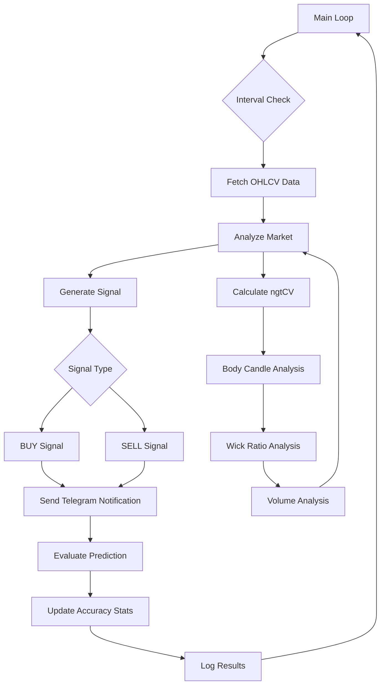

# Rencana Implementasi Skrip Trading Otomatis

## Deskripsi
Skrip Python untuk simulasi trading otomatis menggunakan data OHLCV dari API publik Binance. Skrip ini akan mengambil data candle interval 15 menit atau 1 jam (dipilih lewat variabel), lalu menghitung tren dari ngtCV (body candle, wick, dan volume sebagai proxy dari OHLCV). Setelah sinyal BUY atau SELL muncul, kirimkan notifikasi ke Telegram menggunakan bot token dan chat ID yang disediakan. Tambahkan sistem evaluasi prediksi dengan akurasi real-time.

## Struktur Fungsi Utama

### 1. fetch_ohlcv_data()
- Mengambil data OHLCV dari API Binance
- Parameter: pasangan trading, interval waktu, jumlah candle
- Mengembalikan: list dictionary berisi data OHLCV

### 2. calculate_ngtCV(candle)
- Menghitung indikator ngtCV berdasarkan:
  - Body candle (perbedaan antara open dan close)
  - Wick ratio (perbandingan antara upper dan lower shadow dengan body)
  - Volume sebagai faktor tambahan
- Parameter: satu candle (dict dengan kunci open, high, low, close, volume)
- Mengembalikan: nilai ngtCV

### 3. analyze_market(data)
- Menganalisis pasar berdasarkan beberapa candle terakhir
- Parameter: list candle
- Mengembalikan: sinyal tren (bullish, bearish, atau netral)

### 4. generate_signal(market_analysis)
- Menghasilkan sinyal BUY/SELL berdasarkan analisis pasar
- Parameter: hasil dari analyze_market
- Mengembalikan: sinyal (BUY atau SELL)
### 3. calculate_ngtCV(candle)
- Menghitung indikator ngtCV berdasarkan:
  - Body candle (perbedaan antara open dan close)
  - Wick ratio (perbandingan antara upper dan lower shadow dengan body)
  - Volume sebagai faktor tambahan
- Parameter: satu candle (dict dengan kunci open, high, low, close, volume)
- Mengembalikan: nilai ngtCV, body_size, wick_ratio, volume_factor

### 4. analyze_market(data)
- Menganalisis pasar berdasarkan beberapa candle terakhir
- Menggunakan pendekatan berbasis rata-rata bergerak dari indikator ngtCV
### 5. generate_signal(market_analysis)
- Menghasilkan sinyal BUY/SELL berdasarkan analisis pasar
- Parameter: hasil dari analyze_market (sinyal tren dan kekuatan sinyal)
- Mengembalikan: sinyal (BUY atau SELL) dengan tingkat kepercayaan

### 6. send_telegram(message, bot_token, chat_id)
### 6. send_telegram(message, bot_token, chat_id)
- Mengirim notifikasi ke Telegram
- Parameter: pesan, token bot, chat ID
- Mengembalikan: status pengiriman (sukses/gagal)
### 7. evaluate_prediction(prediction, next_candle)
- Mengevaluasi prediksi terhadap hasil aktual
- Parameter: prediksi sebelumnya, candle berikutnya
- Mengembalikan: benar/salah dan perubahan harga aktual
- Mengirim notifikasi ke Telegram
### 8. main_loop()
- Loop utama yang berjalan terus menerus
- Mengatur interval waktu, memanggil fungsi-fungsi lain
- Menyimpan statistik akurasi
- Parameter: konfigurasi bot (interval, pasangan trading, token telegram, chat id)
- Menggunakan time.sleep() untuk menunggu antar iterasi

## Spesifikasi Teknis Tambahan

### Algoritma Evaluasi Prediksi
1. Simpan prediksi sebelumnya (arah pergerakan: naik/turun)
2. Ketika candle baru selesai:
   - Ambil harga close sebelumnya dan harga close saat ini
   - Hitung perubahan aktual (naik/turun)
   - Bandingkan dengan prediksi sebelumnya
   - Update statistik akurasi
### Konfigurasi Interval Waktu
- Variabel global INTERVAL_TIME yang bisa diatur ke "15m" atau "1h"
- Digunakan dalam permintaan API Binance untuk menentukan timeframe
- Digunakan dalam time.sleep() untuk menentukan jeda antar iterasi
- Interval 15m = 900 detik, interval 1h = 3600 detik
### Logging Sistem
- Gunakan modul logging bawaan Python
- Level logging: INFO untuk aktivitas normal, ERROR untuk kesalahan
- Log mencakup:
  - Waktu eksekusi setiap iterasi
  - Sinyal trading yang dihasilkan
  - Hasil evaluasi prediksi
  - Statistik akurasi terkini
  - Kesalahan API atau koneksi
- Format log: timestamp, level, pesan
### Pengujian dan Validasi
- Uji coba dengan data historis untuk memvalidasi akurasi prediksi
- Simulasikan berbagai kondisi pasar (trending, sideways)
- Uji coba notifikasi Telegram dengan pesan uji
- Validasi perhitungan akurasi dengan contoh manual
- Uji coba dengan interval waktu berbeda (15m dan 1h)
- Pastikan tidak ada memory leak dalam loop utama
- Uji ketahanan sistem terhadap error API sementara
   - Kirim laporan akurasi ke Telegram

### Sistem Akurasi Real-time
- Variabel global untuk menyimpan jumlah prediksi benar dan salah
- Setiap kali evaluasi selesai, hitung ulang persentase akurasi
- Formula: (prediksi_benar / (prediksi_benar + prediksi_salah)) * 100
- Kirim update akurasi ke Telegram setiap kali evaluasi selesai
- Parameter: pesan, token bot, chat ID
- Mengembalikan: status pengiriman (sukses/gagal)

### 7. evaluate_prediction(prediction, next_candle)
### 8. main_loop()
- Loop utama yang berjalan terus menerus
- Mengatur interval waktu, memanggil fungsi-fungsi lain
- Menyimpan statistik akurasi
- Parameter: konfigurasi bot (interval, pasangan trading, token telegram, chat id)
- Menggunakan time.sleep() untuk menunggu antar iterasi
- Mengevaluasi prediksi terhadap hasil aktual
- Parameter: prediksi sebelumnya, candle berikutnya
- Mengembalikan: benar/salah dan perubahan harga aktual
- Parameter: list candle (minimal 10 candle untuk analisis yang valid)
- Mengembalikan: sinyal tren (bullish, bearish, atau netral) dan kekuatan sinyal

### 5. send_telegram(message, bot_token, chat_id)
- Mengirim notifikasi ke Telegram
- Parameter: pesan, token bot, chat ID
- Mengembalikan: status pengiriman

### 6. evaluate_prediction(prediction, next_candle)
- Mengevaluasi prediksi terhadap hasil aktual
- Parameter: prediksi sebelumnya, candle berikutnya
- Mengembalikan: benar/salah

### 7. main_loop()
- Loop utama yang berjalan terus menerus
- Mengatur interval waktu, memanggil fungsi-fungsi lain
- Menyimpan statistik akurasi

## Spesifikasi Teknis

### Library yang Digunakan
- requests: untuk mengakses API Binance dan Telegram
- datetime: untuk pengolahan waktu
- time: untuk delay antar iterasi
- json: untuk parsing data
-其他 standar Python

### Konfigurasi
- Interval waktu: 15m atau 1h (dapat diubah via variabel)
- Pasangan trading: BTCUSDT (bisa diubah)
- Telegram bot token dan chat ID: disimpan dalam variabel konfigurasi

### Algoritma Analisis
1. Hitung body candle sebagai |close - open|
2. Hitung upper shadow sebagai high - max(open, close)
3. Hitung lower shadow sebagai min(open, close) - low
4. Hitung wick ratio sebagai (upper shadow + lower shadow) / body
5. Gunakan volume sebagai faktor konfirmasi
6. Gabungkan semua elemen untuk mendapatkan sinyal tren

### Sistem Evaluasi
- Setiap prediksi dicatat (naik/turun)
- Ketika candle berikutnya close, cocokkan dengan hasil aktual
- Jika benar: tambahkan skor benar
- Jika salah: tambahkan skor salah
- Hitung persentase akurasi: (benar / total prediksi) * 100%
- Kirim laporan akurasi ke Telegram setiap evaluasi selesai

## Flowchart Proses

## Error Handling
- Penanganan kesalahan jaringan saat mengakses API
- Penanganan data yang tidak lengkap atau kosong
- Retry mechanism untuk permintaan API yang gagal
- Logging error untuk debugging

## Pengujian
- Simulasi dengan data historis
- Validasi akurasi prediksi
- Uji coba notifikasi Telegram
- Pengujian dengan berbagai kondisi pasar